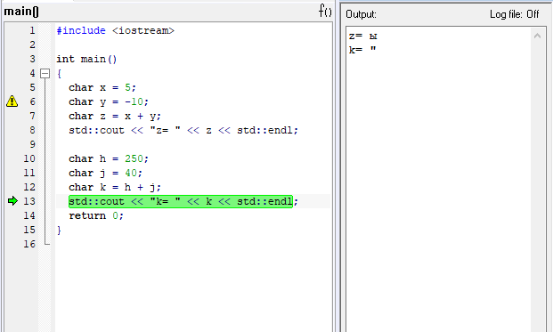
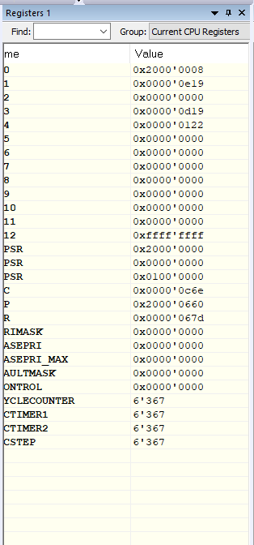
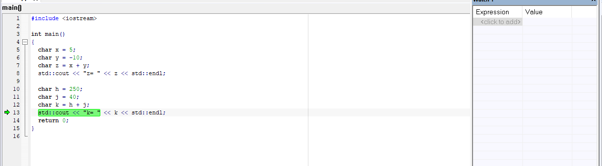
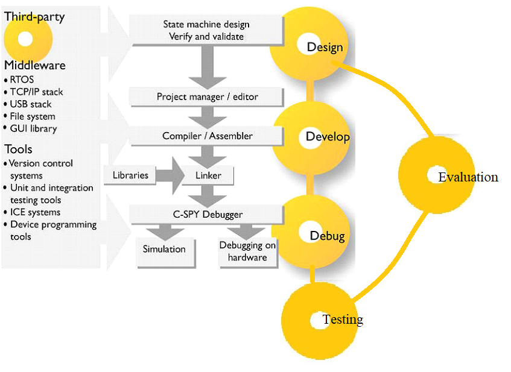

= Лабораторная №1

== Задание
* Создать проект  *Lab1* (С++ с main) с настройками под микроконтроллер *STM32F411RE*.
* Сделать программу, которая считает сумму двух char чисел (например *1* и *-6*, *10* и *250*). Вывести результат в *Terminal I/O*. Объяснить результат.
* Запустить проект на выполнение по симулятором, посмотреть листинг дизамблера - попробовать определить где создались ваши переменные.
* Проверить все переменные в окне *Watch*, сделать пошаговую отладку (F10, F11), посмотреть, как меняются переменные в окне *Watch*. заупустить окно *Registers* и посмотреть значения регистров в которых созданы переменные.

== Работа с программой

Была создана программа которая считает сумму двух char чисел. Переменная типа char занимает 1 байт или 8 бит. Вместо конвертации значения типа char в целое число, оно интерпретируется как ASCII-символ.
ASCII (сокр. от «American Standard Code for Information Interchange») — это американский стандартный код для обмена информацией, который определяет способ представления символов английского языка (+ несколько других) в виде чисел.

image::Code 2021-09-30 095858.png.[]

Все символы компьютерного алфавита имеют свой код от 0 до 255.
Международным стандартом являются символы с кодами от 0 , до 127.
Вторая половина кодовой таблицы ASCII, называемая кодовой страницей, может иметь различные варианты, каждый вариант имеет свой номер.
Кодовая страница в первую очередь используется для размещения национальных алфавитов, отличных от латинского. В русских национальных кодировках в этой части таблицы размещаются символы русского алфавита.

При сложении чисел типа char складывались коды символов, в результате чего на выходе получался новый символ. Например при сложении переменный char d=53 (соответствует символу 5), char f=80 (соответствует символу P), g=d+f=85 (соответствует символу U). В программе приведен данный пример.
Если задать отрицательное значение char например char q=-10, то программа при запуске выдаст следующее предпреждение:

    Warning[Pe068]: integer conversion resulted in a change of sign

Поскольку допустимые значения переменной от 0 до 255 то отрицательное значение невозможно, программа сама его заменит. В данном случае символ в переменной будет соответствовать значение q=246 (символ Ц).

Для использования отрицательных значений можно также использоваться переменные типа signet char допустимые значения переменной от -128 до 127

=== Запуск программы в режиме симуляции
Запускаем проект и смотрим листинг дизамблера.

При нажатии на кнопки (F10, F11) мы проходим каждую строчку кода и перемещаемся в окне _Disassembly_. Здесь мы можем увидеть, где создаются переменные.

Открыв вкладку _Registers_ мы можем увидеть что при прохождении определенной строки значение регистора указаного в окне  _Disassembly_ для определенной переменной изменяется.

Проверить значение при помощи окна watch не удалось, поскольку программа не смогла определить тип переменной (и не позволяет его изменить).

== Вопросы по разделу
[qanda]
*Дайте определение понятию “Интегрированной среде разработки”*::
Ответ: Интегрированные среды разработки программ — средства для комплексного применения на всех технологических этапах создания программ. Они позволяют повысить производительность труда как программистов, так и профессиональных пользователей, автоматизировать создание кодов программ, разрабатывать приложения для архитектуры клиент-сервер, запросов и отчетов
*Что такое компилятор и чем он отличается от транслятора?*::
Ответ:
+
Транслятор (англ. translator — переводчик) — это средство преобразования исходного текста программы на алгоритмическом языке в машинный код.
+
Компилятор  (англ. compiler — составитель, собиратель) читает всю программу целиком, делает ее перевод и создает объектный модуль на машинном языке (из него потом создается законченный вариант программы)

*Что такое компоновщик и какие функции он выполняет?*::
Ответ: Компоновщик (англ. link editor, linker) — инструментальная программа, которая производит компоновку («линковку»): принимает на вход один или несколько объектных модулей и собирает из них исполняемый или библиотечный файл-модуль.
+
*Функции компоновщика:*

- компонует различные объектные файлы;
- устанавливает связи между объявлением функции или переменной с ее определением.

*Почему важен процесс проектирования ПО какие задачи входят в этот процесс?*::
Ответ:
+
Проектируя ПО, разработчик получает возможность:

- оценить  время и стоимость разработки ПО;
- определить необходимые этапы действия, разбить задачи на более мелкие, что в дальнейшем экономит время;
- автоматизировать часть разработки;
- избежать разногласий и неудовлетворённости заказчика и исполнителя.
+
Проектирование ведется поэтапно в соответствии со стадиями :
- Техническое задание;
- Техническое предложение,
- Эскизный проект,
- Технический проект,
- Рабочий проект.

*Дорисуйте процесс разработки ПО, описанный на изображении "IAR_Workbench">>" с учетом итеративности связей в этом процессе*::
Ответ:

*Зачем нужна отладка и в каких случаях она применяется? Для чего применяются точки остановки?*::
Ответ: Отладкой называют выявление и устранение причин неправильной рабо-ты программы. Необходимость проведения отладки возникает при обнаружении ошибок при тестировании. Отладку всегда придется проводить автору программы. Рекомендуют применять индуктивный и дедуктивный подходы к отладке.
+
Если не удается найти причину неправильной работы то ставят точки остановки. С помощью них обычно указывается место, где произошла ошибка. Причиной чаще всего являются некорректные данные для этой операции и/или их отсутствие. При останове на этой  точке просматривается значения участвующих в программе, и ищется ошибка.

*Какие еще важные IAR workbench можно добавить в таблицу "<<"Характеристики IAR">>"*::
Ответ:
- возможность работы с многими микроконтроллерами большого числа производителей;
- постоянное добавление новых микроконтроллеров;
- возможность самостоятельного управления оптимизацией отдельных модулей проекта;
