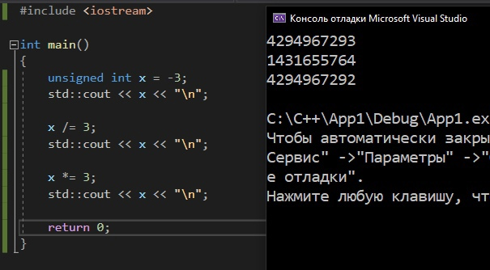
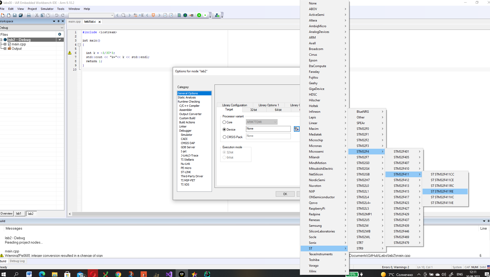
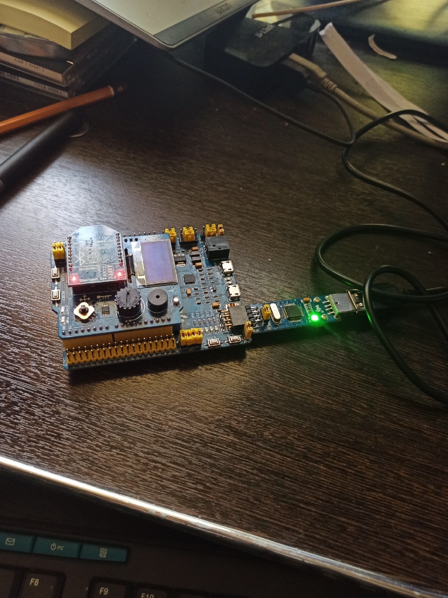

= Лабораторная №2

== Задание
*  Написать программу вычисляющую следующее выражение -3/3U *3 ,удивиться увиденному и объяснить результат.
* Подключить плату к своему домашнему компу, проверить что все работает, плата прошивается и все работает как в аптеке.
* Запустить на плате Lab1 из https://github.com/lamer0k/stm32Labs/tree/master/Lab1
добавить main код для зажигания светодиодов
[source, c]
 RCC::AHB1ENR::GPIOAEN::Enable::Set() ;
  GPIOA::MODER::MODER5::Output::Set() ;
  GPIOA::ODR::ODR5::High::Set() ;
  Не забыть подключить
#include "gpioaregisters.hpp" //for Gpioa

* Пронаблюдать, что произошло на плате, все сфоткать.

* Сделать отчет с описание удивительных вещей из пункта а) и пошаговой работы с платой, с картинками, оглавлением, кодом и всяким модным и современным форматированием, чтобы отчет был читабельным и восхитительным. Описать ошибки которые вы получали при настройки, объяснить, что за ошибки, почему они возникли и как вы их исправили.

== Работа с программой

Была создана программа, которая вычисляет следующее выражение: -3/3U *3

image::code 2021-09-30 105650.png[]

В результате получилось -4, так как литтера U обозначает unsighned type, что и влияет на результат, т.е. тип данных unsigned int - беззнаковое целое число, также как и тип int (знаковое) занимает в памяти 2 байта. Но в отличие от int, тип unsigned int может хранить только положительные целые числа в диапазоне от 0 до 65535 (2^16)-1).

Для объяснения переведем все в десятичный вид:

-3 = 11111111111111111111111111111101b

Вот это 11111111111111111111111111111101  = 4294967293 в безнаковом представлении в десятичном виде.

По стандарту С++ , если ты делишь знаковое на беззнаковое автоматом знаковое кастится к безнаковому.
Таким образом -3 превращается в 4294967293 и делиться на 3 = 1431655764,3333, но это целое, дробная часть выкидывается = 1431655764
Умножаем на 3, оно знаковое, результат умножение кастится к безнаковому  1431655764 *3 = 4 294 967 292 = 11111111111111111111111111111100
А это есть -4 в дополнительном коде

=== Проверка работоспособности платы

* Подключаем плату
* Настраиваем все в IAR, т.е. выбираем наше устройство

image::check_2_2021-09-30 122320.png[]

* Далее открываем проект lab1 и проверяем плату на прошиваемость

 #include "rccregisters.hpp" // for RCC
 std::uint32_t SystemCoreClock = 16'000'000U;
 extern "C" {
int __low_level_init(void)
{
//Switch on external 16 MHz oscillator
RCC::CR::HSION::On::Set();
while (RCC::CR::HSIRDY::NotReady::IsSet())
{
  }
  //Switch system clock on external oscillator
  RCC::CFGR::SW::Hsi::Set();
  while (!RCC::CFGR::SWS::Hsi::IsSet())
  {
  }
  RCC::APB2ENR::SYSCFGEN::Enable::Set();
  return 1;
}
}
int main()
{
  return 0;
}

* Следующим пунктом реализуем зажигание диода
[source, c]
 #include "rccregisters.hpp" // for RCC
 #include "gpioaregisters.hpp" //for Gpioa
 std::uint32_t SystemCoreClock = 16'000'000U;
 extern "C" {
int __low_level_init(void)
{
//Switch on external 16 MHz oscillator
 RCC::CR::HSION::On::Set();
while (RCC::CR::HSIRDY::NotReady::IsSet())
{
 }
//Switch system clock on external oscillator
RCC::CFGR::SW::Hsi::Set();
while (!RCC::CFGR::SWS::Hsi::IsSet())
{
 }
 RCC::APB2ENR::SYSCFGEN::Enable::Set();
 return 1;
 }
 }
 int main()
{
RCC::AHB1ENR::GPIOAEN::Enable::Set();
GPIOA::MODER::MODER5::Output::Set();
GPIOA::ODR::ODR5::High::Set();
 return 0;
}

Результатом представлен на фото ниже:

image::CXlDJpp1ypU.jpg[]
