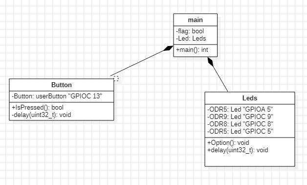

:figure-caption: Рисунок
:table-caption: Таблица
= Лабораторная работа №7
:toc:
:toc-title: Оглавление:

Чепульская КЭ-413 +

=  *Задание* +

=== Сделать программу с использование ООП которая выполняет следющие действия. +
Сразу после запуска должны моргать все светодиоды с частотой 3.33 Гц. 
При нажатии на кнопку(нажатие определяется по её прижатию) режим моргания изменяется на режим Елочки (Зажигаются поочередно первый, через 300 миллисекунд второй, через еще 300 миллисекунд третий и еще через 300 миллисекунду 4 светодиод), потом в обратном порядке гаснут
При следующем нажатии на кнопку  опять все светодиоды начинают моргать с частотой 3.33 Гц
При следующем - снова Елочка и т.д. +
 
=== Разрисовать архитектуру и дизайн ПО, а имеено классы, методы классов и взаимодействия классов в StarUML. +
Можно сгенерировать заготовки классов прямо из программы. Можно сделать все самим
   По архитектуре написать и реализовать классы и потом и логику работы программы.
Все это должно быть в отчете.

= Методология объектно-ориентированного программирования

Объектно-ориентированное программирование (ООП) - совокупность принципов, технологий, а также инструментальных средств для создания программных систем на основе архитектуры взаимодействия объектов. +

Основные принципы ООП: абстракция, наследование, инкапсуляция и полиморфизм.

. *Абстракция данных* - выделение значимой информации и исключение из рассмотрения незначимой. В ООП
рассматривают лишь абстракцию данных, подразумевая набор значимых характеристик объекта, доступный остальной программе (пример абстракция Человека, которая характеризуется только двумя параметрами Рост и Вес и цвет глаз).

. *Класс* представляет собой обетракцию совокупности реальных объектов, которые имеют общий набор свойста и обладают одинаковым поведением, Класс является описываемой на языке терминологии исходного кода моделью ещё не существующей сущности (объекта). Фактически он описывает устройство объекта, являясь своего рода чертежом.

. *Объект* в контексте ООП рассматривается как экземпляр соответствующего класса. (например, классом может являться
фрукт, а экземпляр класса фрукт - яблоко).

. *Наследование* - свойство системы, позволяющее описать новый класс на основе уже существующего с частично или
полностью заимствующейся функциональностью. Класс, от которого производится наследование, называется базовым,
родительским или суперклассом.

= *Схема в StarUML*

Перед началом написания кода нам надо продумать архитектуру, которую мы будем воплащать. Для этого воспользуемся StarUML.

.Архитектура и взаимодействие классов в StarUML.

= *Код*

=== Класс led

Данный класс отвечает за работу диодов. Нам требуется написать две функции, одна из которых отвечает за мигание, другая за бегущий огонек.

[source, c]
#pragma once
#include "gpiocregisters.hpp" //for GPIOC
#include "gpioaregisters.hpp"
class Led
{
// функция задержки
public:
void delay (uint32_t value)
{
for(uint32_t i = 0; i < value; ++i)
{
asm volatile ("");
}
}
//функция первого режима "огонек"
public:
void Option1()
{
//задержка в 600600 обеспечивает частоту мигания в 3,33 Гц
   GPIOC::ODR::ODR5::High::Set() ;
   delay(600600);
   GPIOC::ODR::ODR8::High::Set() ;
   delay(600600);
   GPIOC::ODR::ODR9::High::Set() ;
   delay(600600);
   GPIOA::ODR::ODR5::High::Set() ;
   delay(600600);
   GPIOA::ODR::ODR5::Low::Set() ;
   delay(600600);
   GPIOC::ODR::ODR9::Low::Set() ;
   delay(600600);
   GPIOC::ODR::ODR8::Low::Set() ;
   delay(600600);
   GPIOC::ODR::ODR5::Low::Set() ;
   delay(600600);
}
//функция второго режима "мигание"
public:
void Option2()
{
   GPIOA::ODR::ODR5::High::Set() ;
   GPIOC::ODR::ODR5::High::Set() ;
   GPIOC::ODR::ODR8::High::Set() ;
   GPIOC::ODR::ODR9::High::Set() ;
   delay(600600);
   GPIOA::ODR::ODR5::Low::Set() ;
   GPIOC::ODR::ODR5::Low::Set() ;
   GPIOC::ODR::ODR8::Low::Set() ;
   GPIOC::ODR::ODR9::Low::Set() ;
   delay(600600);
}
};

=== Класс USER button

Данный класс отвечает за кнопку, с помощью кнопки происходит переключение режима.

[source, c]
#pragma once
#include "gpiocregisters.hpp"
class Button
{
//функция для защиты от дребезга кнопки
 void delay1 (uint32_t value)
{
for(uint32_t i = 0; i < value; ++i)
{
 asm volatile ("");
}
}
public:
bool IsPressed()
{
 bool result = false;
 if (GPIOC::IDR::IDR13::Low::IsSet())
  {
  delay1(1000000);
  result = true;
  }
 return result;
}
};

=== Общий код программы

Далее представим общий вид программы.

[source, c]
#include "gpioaregisters.hpp" //for GPIOC
#include "gpiocregisters.hpp" //for GPIOC
#include "rccregisters.hpp"   //for RCC
#include <iostream>
#include "Leed.h"
#include "Button.h"
std::uint32_t SystemCoreClock = 16'000'000U;
extern "C"
{
int __low_level_init(void)
  {
  //Switch on external 16 MHz oscillator
  RCC::CR::HSION::On::Set();
  while (RCC::CR::HSIRDY::NotReady::IsSet())
  {
  }
  //Switch system clock on external oscillator
  RCC::CFGR::SW::Hsi::Set();
  while (!RCC::CFGR::SWS::Hsi::IsSet())
  {
  }
  RCC::APB2ENR::SYSCFGEN::Enable::Set();
  RCC::AHB1ENR::GPIOAEN::Enable::Set();
  RCC::AHB1ENR::GPIOCEN::Enable::Set();
  GPIOA::OSPEEDR::OSPEEDR5::MediumSpeed::Set();
  GPIOA::MODER::MODER5::Output::Set();
  GPIOC::OSPEEDR::OSPEEDR13::MediumSpeed::Set();
  GPIOC::MODER::MODER13::Input::Set();
  GPIOC::OSPEEDR::OSPEEDR5::MediumSpeed::Set();
  GPIOC::MODER::MODER5::Output::Set();
  GPIOC::OSPEEDR::OSPEEDR8::MediumSpeed::Set();
  GPIOC::MODER::MODER8::Output::Set();
  GPIOC::OSPEEDR::OSPEEDR9::MediumSpeed::Set();
  GPIOC::MODER::MODER9::Output::Set();
  return 1;
 }
}
bool flag = false;
Led Leds;
Button userButton;
int main()
{
for (;;)
{
     if (flag == false)
      {
       Leds.Option2();
      }
      else
      {
       Leds.Option1();
      }
     if (userButton.IsPressed())
      {
         flag = !flag;
      }
   }
  return 1;
}

= *Результат* 

.Результат программы
image::VID_20211111_203806 (1).gif[]

